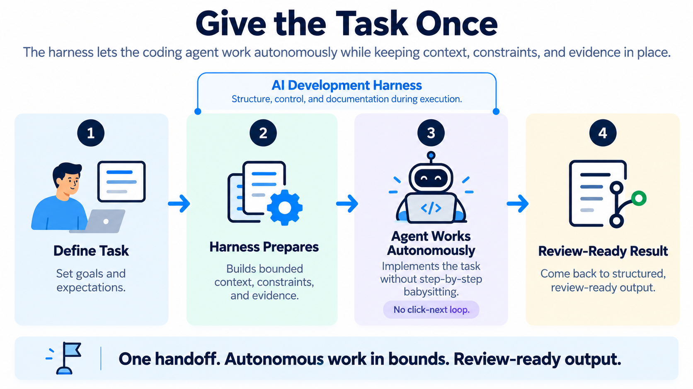

# AI SDLC Harness

AI SDLC Harness is a repo-local workflow for bounded, reviewable AI-assisted software changes. It turns a rough request into explicit task artifacts, a task-scoped implementation handoff, factual evidence, and deterministic workflow status that humans and coding agents can follow.

The coding agent does the work. Harness structures, guides, and records the workflow. The developer remains the authority over intent, consequential decisions, and acceptance.

```text
Coding agent = executor
Harness = control layer
Developer = authority
```

AI SDLC Harness provides first-party, repository-scoped integrations for Codex, Claude Code, and Gemini CLI while remaining agent-neutral. See [Compatibility](docs/compatibility.md) for detailed support and validation status.

The Harness does not call an AI model or implement the task. It supplies the control layer around that work: scope, acceptance criteria, test intent, current generated context, integrity checks, and visible human-review boundaries.

AI SDLC Harness is a control layer, not a security sandbox. Harness boundaries are not security boundaries. It structures intent, context, workflow state, verification, and human decision points so coding agents have explicit workflow and authority boundaries. Those boundaries guide the intended development process but do not provide hard runtime enforcement. Use platform controls such as permissions, sandboxing, branch protections, CI/CD policy, and execution isolation where technical prevention is required.

The two layers are complementary: the agent runtime determines what execution is technically possible; the Harness makes explicit what work is intended, current, and reviewable.

With a repository Agent Skill installed, a coding agent can use Harness status as its workflow navigator, work from the current bounded handoff, record factual evidence and verification, and continue through routine safe steps without asking for approval after every command. It should stop when a real human decision is required, necessary information is unavailable, scope or intent is consequentially ambiguous, or Harness reports a blocking condition.

In the diagram, “autonomously” means this bounded, status-guided continuation, not guaranteed uninterrupted completion. Harness does not invoke or orchestrate the agent.



## What It Provides

- Human-owned task files for scope, acceptance criteria, architecture, coupling, test intent, verification, and evidence.
- Deterministic reports and a bounded `agent-workset.md` generated from those task files.
- `ai-sdlc status`, which derives the current phase and the next valid action from repository state.
- Lineage checks that identify missing, stale, fresh, or unknown generated planning artifacts.
- Validation-currentness and manifest-integrity signals without claiming correctness, security, or approval.
- Optional repository Agent Skills for Codex, Claude Code, and Gemini CLI.

Harness task and control state lives in the repository under `.harness/`, so the task record can be reviewed alongside the change instead of existing only in chat history. Optional agent adapters live at agent-specific paths in the same repository.

## Quick Start

Install AI SDLC Harness as an isolated command-line tool:

```bash
uv tool install ai-sdlc-harness
ai-sdlc --version
```

As a secondary option, use `pipx install ai-sdlc-harness`.

Then run the first three commands in the repository you want to govern:

```bash
ai-sdlc init
ai-sdlc task start "Add request timeout handling"
ai-sdlc status --task add-request-timeout-handling
```

Edit the new human-owned files under `.harness/tasks/add-request-timeout-handling/`, especially `task.md`, `acceptance.md`, and `test-contract.md`. A coding agent may help draft these files within the developer's stated intent; human-owned means the developer retains authority, not that every line must be typed manually. Rerun `status` and follow the command or human action shown under `next:`. The Harness routes the recorded workflow through readiness, specification, test-contract review, implementation handoff, evidence, validation, and final human review; it does not launch or orchestrate the agent.

When the phase reaches `implementation`, use:

```text
.harness/tasks/add-request-timeout-handling/generated/agent-workset.md
```

as the bounded handoff for the human or coding agent doing the change. Record only factual results in `evidence.md` and the commands actually run in `verification.md`, then rerun `status`.

See the [Quickstart](docs/quickstart.md) for the complete walkthrough.

## Optional Agent Skills

After `ai-sdlc init`, install one repository-scoped adapter or all three:

```bash
ai-sdlc adapter install codex
ai-sdlc adapter install claude-code
ai-sdlc adapter install gemini-cli
# or: ai-sdlc adapter install all
```

These commands install a thin Harness skill at the supported repository path for each agent. They do not modify root `AGENTS.md`, `CLAUDE.md`, or `GEMINI.md`. Existing unmanaged files at the adapter paths are not adopted or overwritten.

## Workflow Outcomes

`ai-sdlc status` reports one of four outcomes:

- `NEXT` — run the displayed Harness command.
- `REVIEW_REQUIRED` — a person must edit, review, resolve, or accept the indicated material.
- `BLOCKED` — correct the reported integrity, safety, or workflow problem before continuing.
- `COMPLETE` — the Harness workflow record is complete; normal human review and delivery still remain.

Use `ai-sdlc status --json` for deterministic machine-readable navigation. If more than one task exists, select one explicitly with `--task <task-slug>`.

## Source Of Truth And Integrity

Human-owned task files are the authoritative inputs. Generated reports, projections, and worksets are managed outputs; do not edit them directly. If task intent changes, edit the source task files and follow `status` to regenerate anything stale.

`ai-sdlc verify` checks Harness structure and protected-file hashes. `ai-sdlc validate --task <task-slug>` evaluates workflow consistency and recorded review-readiness signals. Neither command runs project tests or proves that an implementation is correct, secure, compliant, approved, or ready to release.

## Current Limits

AI SDLC Harness does not:

- call AI models or launch or orchestrate coding agents
- run continuously in the background or implement application code
- generate or run project tests
- deeply inspect application code
- scan for vulnerabilities or validate compliance
- prove correctness, approve work, or determine release readiness
- enforce optional packs

It gives humans and coding agents a smaller, current, inspectable workflow record; it does not replace engineering judgment or normal delivery controls.

## Learn More

- [Quickstart](docs/quickstart.md)
- [Core Concepts](docs/concepts.md)
- [Security and Integrity](docs/security-and-integrity.md)
- [Compatibility](docs/compatibility.md)
- [Contributing](CONTRIBUTING.md)
