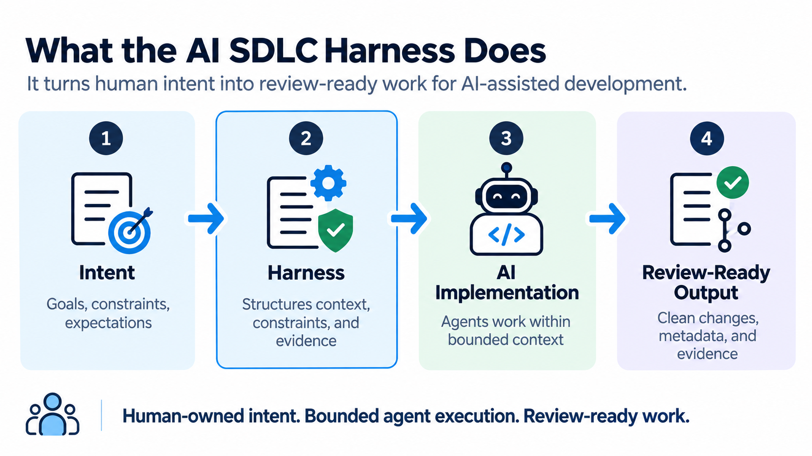
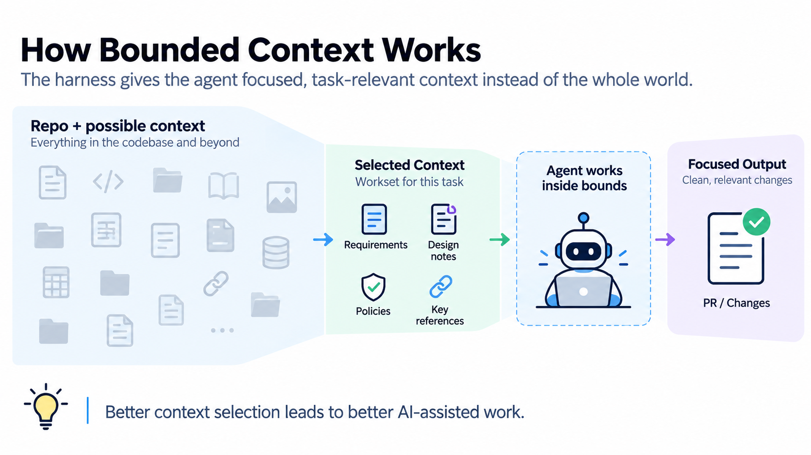
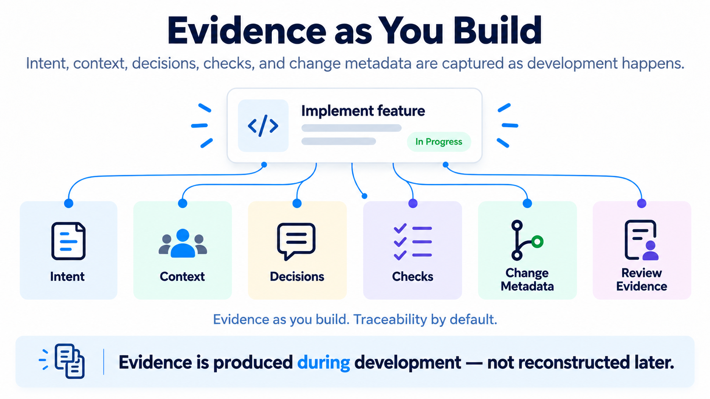

# Core Concepts

AI SDLC Harness is a repo-local control layer for bounded AI-assisted software work. It separates human intent from generated workflow outputs, derives the next valid action from current repository state, and preserves explicit human-review boundaries.

For a command-by-command walkthrough, see the [Quickstart](quickstart.md).

## Roles And Authority

The operating model has three distinct roles:

1. **Developer / human** — owns intent and authority, supplies or approves decisions that cannot be delegated, and reviews consequential outcomes.
2. **Coding agent** — executes the engineering work, consults Harness task state and status, performs bounded implementation and verification, and records evidence. It may assist with or draft authoritative task files, but it must not invent missing requirements, approve for the developer, or redefine intent merely to unblock itself.
3. **Harness** — is the deterministic repo-local control layer. It validates state, currentness, and integrity; exposes next actions and boundaries; and records workflow state. It does not reason about the task, implement application code, call an AI model, launch an agent, or approve an outcome.

In short: coding agent = executor, Harness = control layer, developer = authority. “Human-owned” means that authority stays with the developer; it does not mean a human must manually author every artifact or approve every routine workflow transition.



## Trust Boundary

AI SDLC Harness is a procedural control layer, not a security sandbox or runtime reference monitor. It deterministically structures and maintains the repository workflow record: authoritative task intent, bounded context, workflow state, validation currentness, verification and evidence expectations, human decision points, and agent-facing instructions and next actions. These controls define the intended operating envelope for the coding agent without reducing Harness to documentation alone.

Harness does not call a model or launch or orchestrate an agent. Harness workflow and authority boundaries are not security boundaries or technical restrictions on an already-running agent or its tools. Harness cannot prevent an agent, model, shell, IDE, or other execution environment from ignoring instructions, modifying out-of-scope files, running available commands, accessing data or secrets allowed by that environment, committing or pushing when credentials and repository permissions allow it, performing destructive actions, or interacting with deployment or production systems when separately authorized.

The underlying runtime and platform controls determine what execution is technically possible, while Harness makes explicit what work is intended, current, bounded, and reviewable. When prevention matters, use controls such as OS, container, or VM sandboxing; filesystem and process permissions; least-privilege credentials and secret isolation; repository permissions and branch protections; CI/CD policy and protected deployment environments; network restrictions; and execution isolation.

The responsibility boundary is therefore:

```text
Harness defines and maintains the intended operating envelope.
Platform and security controls enforce what must be technically impossible.
```

The developer remains the authority over intent, consequential decisions, and acceptance. Routine bounded work may proceed through Harness-directed next actions without human approval after every command, but `COMPLETE` means only that the Harness workflow record is complete—not that the change is correct, secure, compliant, approved, or ready for release.

## Artifact Model

| Kind | Examples | Rule |
| --- | --- | --- |
| Human-owned task sources | `task.md`, `acceptance.md`, `test-contract.md`, `verification.md`, `evidence.md` | Edit these to change intent or record facts. |
| Generated planning and handoff outputs | `preflight.md`, `spec.md`, `requirements.yaml`, `test-contract-review.md`, `generated/agent-workset.md`, `generated/context-manifest.yaml` | Do not edit directly; rerun the owning command. |
| Generated review outputs | `evidence-report.md`, `validation-report.md` | Do not edit directly; update source evidence or verification and regenerate. |
| Harness control-plane files | `.harness/config.yaml`, `.harness/state.json`, `.harness/manifest.json` | Managed by the Harness; do not hand-edit. |

Human-owned task sources are authoritative inputs. A coding agent may draft or update them within the developer's stated intent, but ownership and decision authority remain human. Generated artifacts summarize, project, review, or package those inputs. In particular, `requirements.yaml` is an advisory structured projection, not the source of requirements.

## Task

A task is the Harness unit of work: one bounded change that a human wants to implement, verify, and review. `ai-sdlc task start` converts a human-readable title into a safe slug and creates the task's source artifacts under `.harness/tasks/<task-slug>/`.

Task selection is explicit. If a repository has multiple tasks, use `ai-sdlc status --task <task-slug>`; the Harness does not persist or guess a hidden active task.

## Status, Phase, And Outcome

`ai-sdlc status` is a read-only workflow resolver. It inspects current task files, generated-artifact freshness, validation currentness, and Harness integrity to derive:

- the selected task and current phase
- one outcome category
- the next valid command or human action
- bounded findings that explain warnings or blockers

The four outcome categories are deliberately small:

- `NEXT` — a deterministic Harness command can advance the workflow.
- `REVIEW_REQUIRED` — a person must supply, review, resolve, or accept something.
- `BLOCKED` — an integrity, safety, or workflow problem prevents safe progression.
- `COMPLETE` — the Harness workflow record is complete, but normal review and delivery remain.

`COMPLETE` is not proof of correctness, security, compliance, approval, or release readiness.

## Lineage And Freshness

Lineage records which exact source bytes and bounded repository observations produced a generated artifact. Status resolves four selector-facing outputs:

- preflight
- specification
- advisory requirements projection
- test-contract review

Each is `fresh`, `stale`, `missing`, or `unknown`. When a source dependency changes, status routes the task back to the owning producer instead of silently treating old output as current. Generated handoff and review stages build on those freshness decisions.

Lineage is closed and producer-specific: each output observes only its declared dependencies and repository predicates. It is not a whole-repository semantic analysis.

## Workset

`generated/agent-workset.md` is the bounded implementation handoff for a human or coding agent. It combines current task intent, selected shallow repository context, relevant warnings, baseline secure-engineering guidance, and evidence expectations. Its generated companion, `generated/context-manifest.yaml`, records the exact selection snapshot, hashes, budgets, findings, and workset linkage.

The workset reduces dependence on broad prompts and stale chat history, but it is not an automatic token guarantee and does not replace task-relevant code inspection.



## Evidence And Verification

`evidence.md` records what changed and why. `verification.md` records checks actually run and their observed results. These are human-owned factual sources.

`ai-sdlc evidence` generates `evidence-report.md` from that record. The report can identify missing or weak evidence, but it does not run tests or establish that a claim is true.

Evidence is not captured automatically: the coding agent or developer records factual sources as work proceeds, and Harness turns those records into review-readiness signals.



## Validation Currentness

`ai-sdlc validate` produces `validation-report.md` from a closed snapshot of task sources, generated dependencies, and bounded repository observations. Validation currentness can be `missing`, `current`, `stale`, `unknown`, or `invalid`.

A clean, current validation means the recorded workflow inputs and outputs satisfy the Harness's deterministic checks. It does not mean the implementation itself has been proven correct, secure, compliant, approved, or ready to release.

## Manifest Integrity

The main manifest records ownership and hashes for protected Harness files and generated artifacts. `ai-sdlc verify` checks structure, safe paths, and managed-file integrity.

Human-owned task source content remains editable; generated and control-plane files remain integrity subjects. Existing unmanaged files are not automatically claimed or overwritten.

## Agent Adapters

An adapter is a thin repository Agent Skill for Codex, Claude Code, or Gemini CLI. It tells the agent to use structured status as the workflow navigator, follow declared next actions, use the generated workset at implementation, preserve managed outputs, and record factual evidence. The agent can continue through routine bounded steps without stopping after every command, but must stop when a real authority decision, unavailable information, consequential ambiguity, or a blocking condition requires the developer.

Adapters do not contain a second workflow engine. They do not bypass `BLOCKED` or `REVIEW_REQUIRED`, and they do not turn `COMPLETE` into approval. Installation is explicit and does not modify root agent instruction files.

## Optional Packs

An optional pack is a future-facing concern-specific guardrail bundle. No packs are selected by default, and the current command surface does not enforce packs. Baseline workflow and secure-engineering guidance do not depend on a selected pack.

## Deliberate Boundaries

The Harness is deterministic scaffolding, not an autonomous engineer or assurance system. It does not call AI models, generate code or tests, run project tests, deeply inspect application code, scan for vulnerabilities, validate compliance, approve work, or decide release readiness.

Those boundaries keep its claims narrow: the Harness can show that its own workflow record is current and internally consistent, while people and project-specific tools remain responsible for the software change itself.
